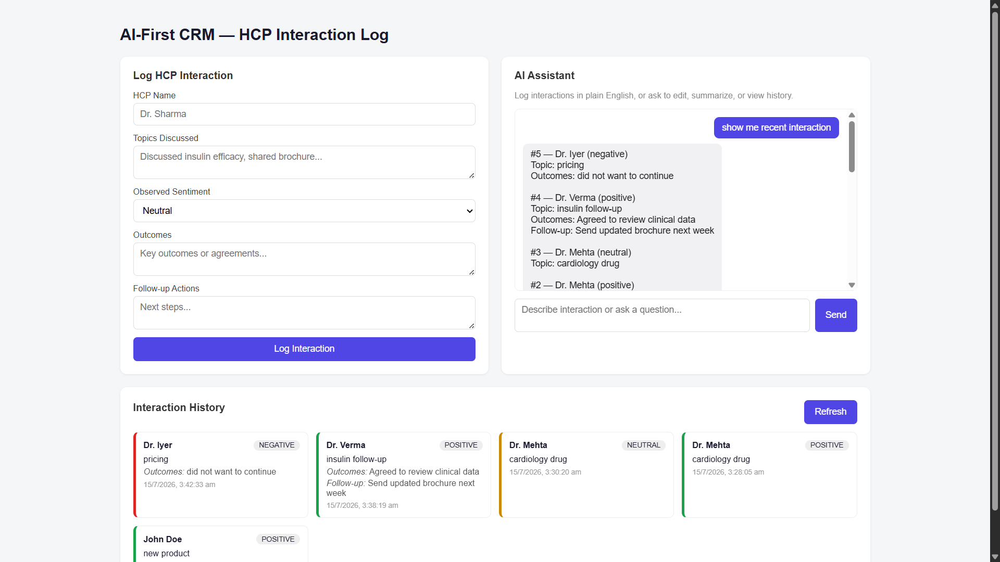
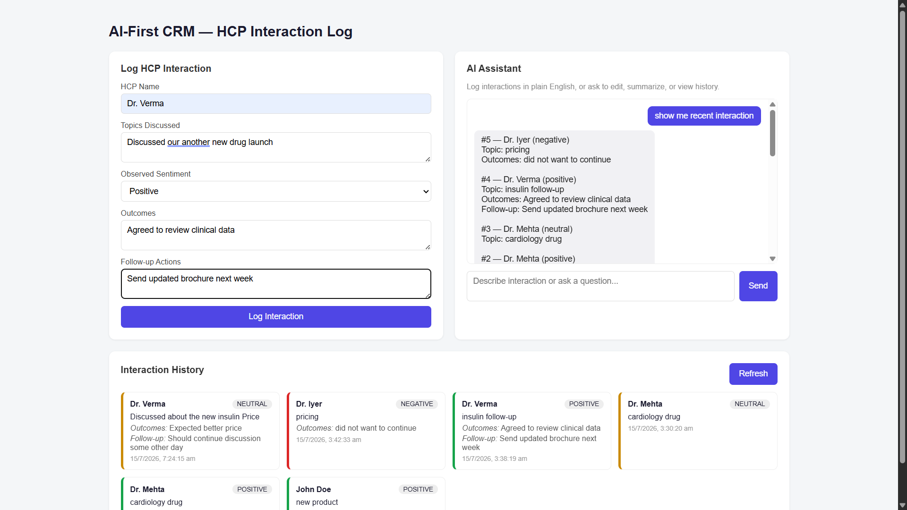
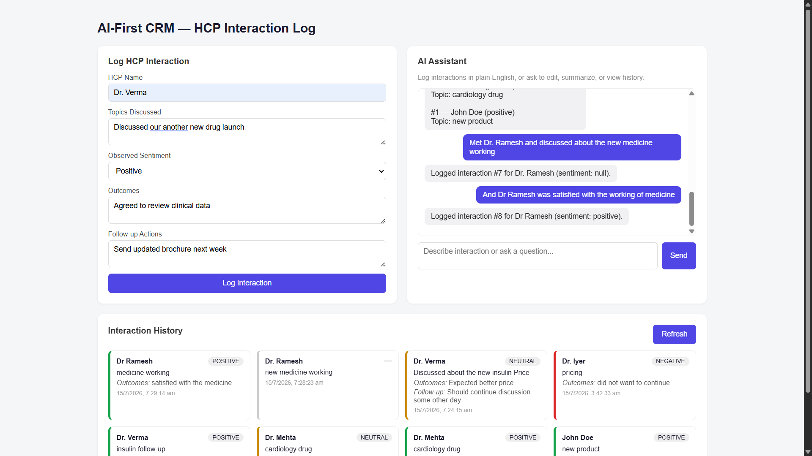
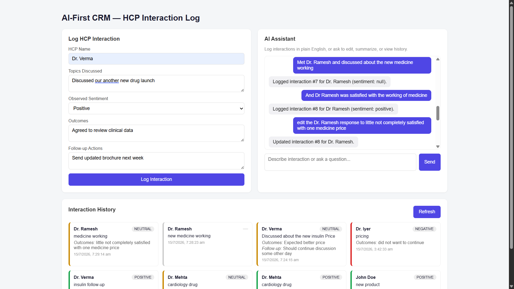
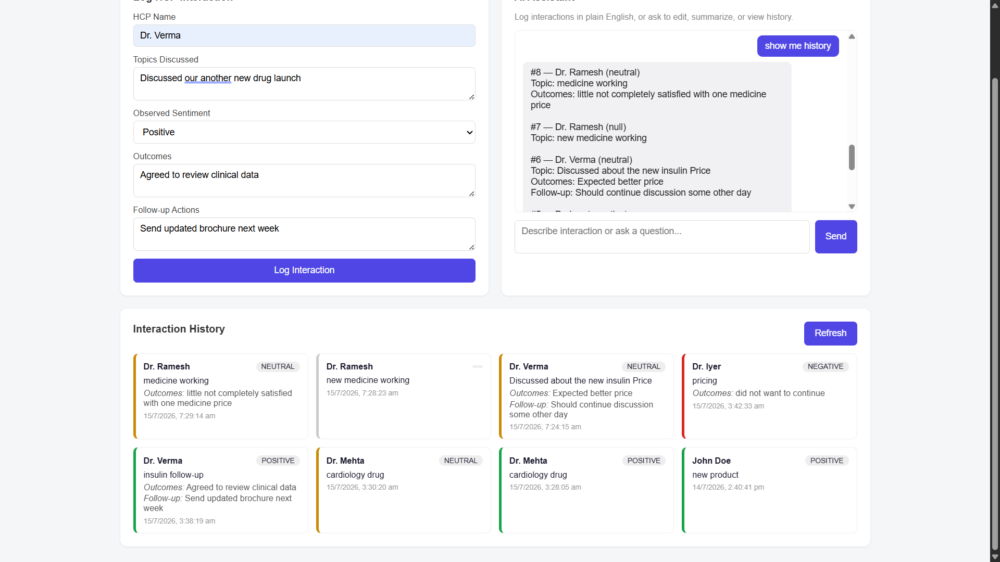
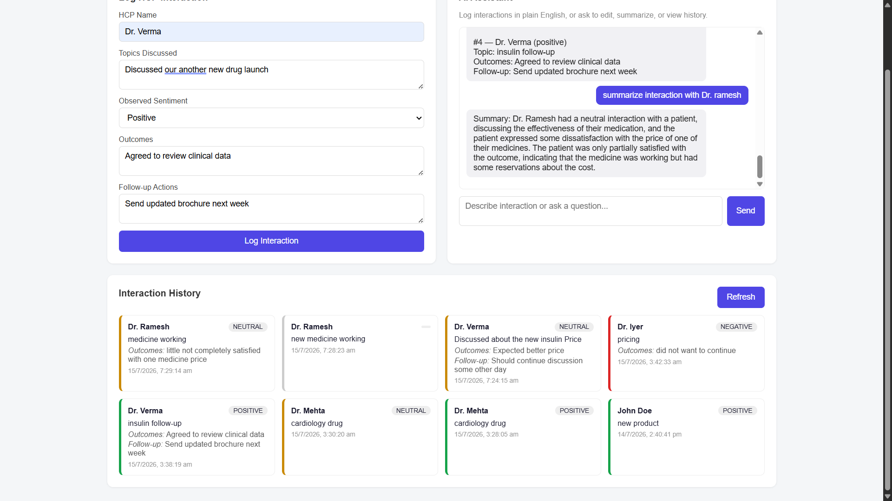
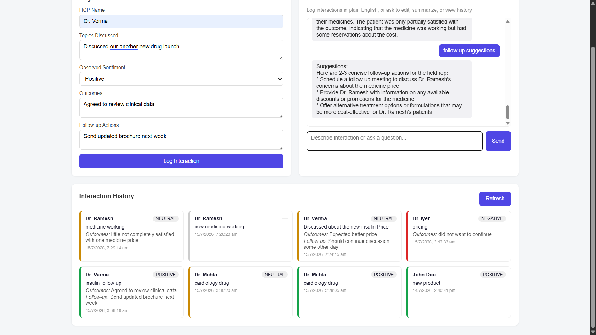

# Aivoa AI CRM — HCP Interaction Log

### 🔗 Live site: [https://avivoa-assignment.vercel.app/](https://avivoa-assignment.vercel.app/)

A CRM screen built for pharma field reps to log their conversations with
doctors (HCPs — Healthcare Professionals). You can log an interaction two
ways: **filling out a form**, or **just typing what happened in plain
English** to an AI assistant that figures out what to do with it.

This document walks through exactly what the app does and how, with
screenshots of it running live.

---

## What am I looking at?

The screen has three parts:

1. **Log HCP Interaction** (left) — a normal form. Fill it in, click a
   button, done.
2. **AI Assistant** (right) — a chat box. Type a sentence, the AI understands
   it and takes the right action.
3. **Interaction History** (bottom) — every interaction ever logged, shown as
   cards. The colored left-edge of each card tells you the doctor's sentiment
   at a glance — green (positive), yellow (neutral), red (negative).

Both the form and the chat save to the exact same list you see in the
history — they're just two different doors into the same room.

---

## Option 1: Logging with the form

This is the traditional way — you fill in each box yourself.

- **HCP Name** — who you met
- **Topics Discussed** — what you talked about
- **Observed Sentiment** — how they seemed (Positive / Neutral / Negative)
- **Outcomes** — what was agreed or decided
- **Follow-up Actions** — what happens next

Click **Log Interaction**, and it instantly shows up as a new card at the
bottom of the page.

---

## Option 2: Logging by just talking to the AI

This is the interesting part. Instead of filling boxes, you type a normal
sentence — like you're texting a colleague — and the AI does the rest.

### Example: logging a new interaction

> *"Met Dr. Ramesh and discussed about the new medicine working"*

The AI read that sentence, understood it was describing a **new**
interaction (not an edit or a question), pulled out the doctor's name and
topic on its own, and saved it — replying with confirmation: *"Logged
interaction #7 for Dr. Ramesh."*

(You'll notice sentiment came back as "null" here — that's because the
sentence didn't actually say how Dr. Ramesh felt. The AI only fills in what's
actually there; it doesn't guess. In the next message below, sentiment *was*
mentioned, and it correctly picked that up.)

### Example: editing something you just said

> *"And Dr Ramesh was satisfied with the working of medicine"*
> *"edit the Dr. Ramesh response to little not completely satisfied with one medicine price"*

Here the AI understood the second message wasn't a new interaction — it was
a correction to the one just logged. It found the right record and updated
it, without you needing to say an ID number or which record you meant.

### Example: asking to see your history

> *"show me history"*

Instead of scrolling down to the cards, you can just ask the AI directly,
and it lists out your recent interactions right there in the chat —
including full details like outcomes and follow-ups, not just names.

### Example: asking for a summary

> *"summarize interaction with Dr. Ramesh"*

The AI writes a short, plain-English summary of that logged interaction —
useful when you don't want to re-read the whole thing.

### Example: asking what to do next

> *"follow up suggestions"*

Based on what was actually said in the interaction, the AI suggests concrete
next steps — like scheduling a follow-up meeting or sharing pricing
information — tailored to that specific conversation, not generic advice.

---

## How does the AI actually "know" what to do?

Behind the scenes, every message you type in the chat gets sent to an AI
agent (built with a framework called **LangGraph**, running a large language
model from **Groq**). This agent has been given a list of 5 things it's
allowed to do:

| # | Tool | Triggered by messages like... |
|---|------|-------------------------------|
| 1 | **Log a new interaction** | "Met Dr. X, discussed Y, they seemed positive" |
| 2 | **Edit an existing interaction** | "Edit that, change the sentiment to neutral" |
| 3 | **Get interaction history** | "Show me my recent interactions" |
| 4 | **Summarize an interaction** | "Summarize the last one" |
| 5 | **Suggest follow-up actions** | "What should I do next?" |

The AI reads your sentence, decides which of these 5 things fits best, and
figures out the details itself (which doctor, what topic, which record to
edit) — nobody hardcoded a list of keywords to match against. This
decision-making is what makes it an "AI agent" rather than a simple form.

---

## Tech stack (for the curious)

- **Frontend:** React + Redux Toolkit, deployed on Vercel
- **Backend:** Python + FastAPI
- **AI Agent:** LangGraph, using Groq's `llama-3.3-70b-versatile` model
- **Database:** SQLite (stores every interaction as a row)

---

## Try it yourself

Visit **[the live site](https://avivoa-assignment.vercel.app/)** and:

1. Try the form on the left with a doctor you make up
2. Type something like *"Met Dr. Patel, discussed the new vaccine, she was
   very enthusiastic"* into the chat
3. Ask it *"show me my recent interactions"*
4. Ask it to *"summarize the last interaction"*
5. Watch the history panel update after every action
